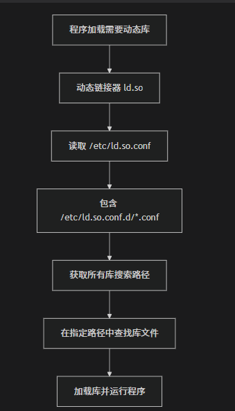

1. 
我其实有个问题
像muduo库 这种 
vcpkg并不支持 如果我的CMakeLists 使用vcpkg构建项目的时候
我要是直接 target_include_directory 包含 可以的嘛？

- 仅仅  target_include_directory 是不够的
- 继承
  - add_subdirectory()
  - target_link_library() 
    - muduo_net
    - muduo_base
    

* [x] 11_7
* [x] 11_19
* [ ] 

2. 
```cmake
cmake_minimum_required(VERSION 3.20)
set(CMAKE_CXX_STANDARD 17)
set(CMAKE_CXX_STANDARD_REQUIRED ON)

`# 生成编译文件 compile_commands.json `
set(CMAKE_EXPORT_COMPILE_COMMANDS ON)

project(LosMq)
```
* [x] 11_7
* [x] 11_19


3. /etc/ld.so.conf 这个文件下面放的都是默认查找的



- [x] 11_19
- [ ] 


3. 
   ```cmake
   cmake_minimum_required(VERSION 3.20)
   set(CMAKE_CXX_STANDARD 17)
   set(CMAKE_CXX_STANDARD_REQUIRED ON)
   
   # 生成编译文件 compile_commands.json 
   set(CMAKE_EXPORT_COMPILE_COMMANDS ON)
   project(LosMq LANGUAGES CXX)
   
   add_subdirectory(three/muduo)
   
   add_executable(LosMq main.cc)
   
   target_include_directories(
       LosMq
       PUBLIC
       three/muduo
   )
   
   target_link_libraries(
       LosMq
       PRIVATE
       muduo_net
       muduo_base
   
   )
   
   
   ```

我想知道 这个 private 和 public的区别？

private:

- 属性仅仅用于当前目标的构建
- 不会传递给连接词目标的其他目标

public:

- 既用于当前目标，也传递给链接此目标的其它目标


5. muduo_net会自动依赖 muduo_base 

- [x] 11_19
- [ ] 


