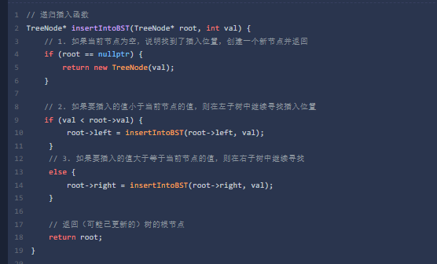

1. mysqld 查看完整的选项列表

mysqld --verbose --help


2. mysql 登录服务器的指令
```shell
mysql -uuser_name -p [db_name]
```
- 回车之后 就是要输入密码了


3. select DATABASE();

查询并显示 当前连接会话 正在使用的数据库名称

- [x] 11_13

- [x] 11_14

- [ ] 


4. mysql 的相关指令
- -h 指定连接的主机号  默认是localhost 或者 127.0.0.1
- -p 指定连接的端口号

- [ ] 11_13


5. 二叉搜索树 BST的构建



