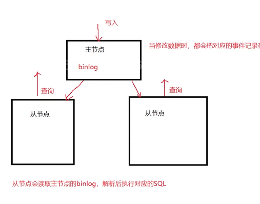
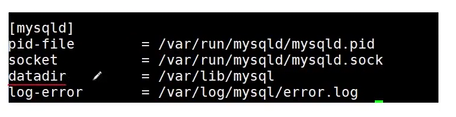

1. mysqldumpslow 总结慢查询日志

- 作用：在平时 使用mysql数据库的时候 经常进行查询操作，有些查询语句的执行时间非常的长，当执行的时间超过设定的阈值的时候，我们称这个查询为慢查询，慢查询的相关信息都要用日志记录下来称为慢查询。
- 这个指令可以 解析 并汇总其内容 
- 通常情况下 一般会把数字和字符串用N和S来代替
- [ ] 11_14
- [ ] 

2. 
```shell
show variables like `xxx`
如何理解
```
- 就是 变量名 等于xxx的 变量


3. 
mysqldumpslow 常用字段

4. mysqlbinlog 处理二进制日志文件

- 我们平时对数据库的修改 包括对数据的增删改 都会被描述为一个“事件” 每个事件都会以二进制的形式记录在一个文件里面 ，这个文件就是服务器的二进制日志文件 称为 Binary Log

5. 

mysqlbinlog 能够以 文本格式 显示二进制文件



/var/lib/mysql 

这个就是数据目录

