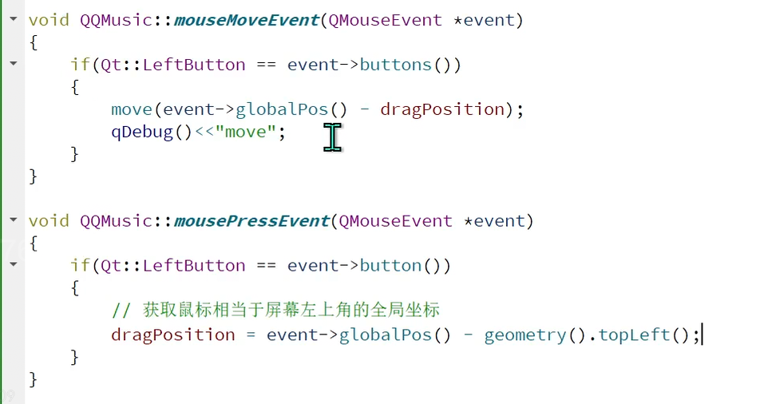
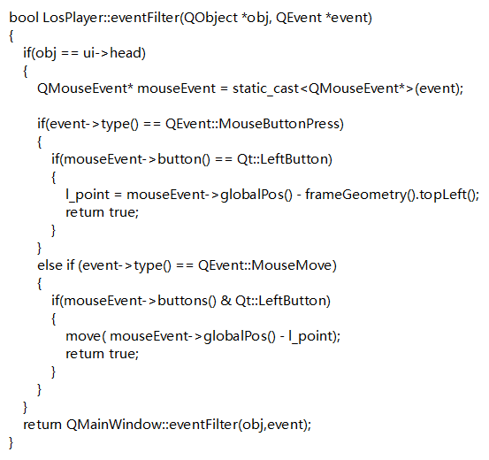

1. co_spawn(io_context, listener(), detached);
- 第一个参数是执行器
- 第二个参数是可等待对象
- 第三个参数是完成令牌
  - detached 就是什么都不用告诉我
  - asio::use_awaitable 把返回结果给我

2. 如何实现拖拽Qt

   



3. 增加阴影效果

   ```c++
    QGraphicsDropShadowEffect* shadow = new QGraphicsDropShadowEffect(this);
       shadow->setOffset(0,0);
       shadow->setColor("#000000");
       shadow->setBlurRadius(10);
       this->setGraphicsEffect(shadow);
   ```


4. 

如何通过代码实现 
qt 鼠标悬停 鼠标样式改变

重写这两个函数:

```C++
void enterEvent(QEnterEvent* event) override;
void leaveEvent(QEvent* event) override;
```

```C++
void RecBoxItem::enterEvent(QEnterEvent *event)
{
    ui->recMusicBtn->setCursor(Qt::PointingHandCursor);
    QWidget::enterEvent(event);
}

void RecBoxItem::leaveEvent(QEvent *event)
{
    ui->recMusicBtn->unsetCursor();
    QWidget::leaveEvent(event);
}

```


5. enterEvent 和 eventFilter的区别

- enterEvent 是事件处理器 仅仅处理Widget的QEvent::Enter 事件


- enterFilter可以处理更多事件
- 在监视者这里 实现eventFilter函数 并在监视者对象上调用installEventFilter


