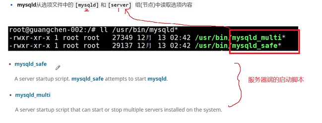

1. 

mysqld

从选项文件中的 [mysqld] 和 [server] 组(节点)读取选项内容

2. 
   

3. 常用的选项

- --character-set-server   系统变量: character_set_server 服务器的默认字符集 默认是 utf8mb4

- --collation-sever  服务器的默认排序 默认为utf8mb4_0900_ai_ci 

  -  utf8mb4 编码集
  -  0900 unicode的版本
  -  ai accent insentitive 口音不敏感
  -  ci case insentitive  忽略大小写
  -  同样的还有as cs ks(针对日语的)

4. --datadir 就是mysql服务器的数据目录

- [ ] 11_14

5. --port 就是mysql服务启动之后监听的端口号

