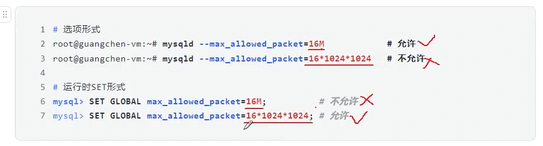

1.

 ```shell
 set persist max_connections = 1000
 这个语句的作用是？
 ```
- 修改当前服务器的 max_connections 是1000
- 把这个配置写入 持久化配置存储中 mysqld-auto.cnf 
- persist 这个的作用就是 


2. 
设置 Session 系统变量

```shell
SET SESSION time_zone = '+8:00';
set @SESSION.time_zone = '+8:00';
 
```

只是对当前的连接 生效

 

3. 
mysqld --max_allowed_packet = 16M


4.  参数模板
```c++
#include <cmath>
#include <iostream>
#include <ostream>

template <class T> constexpr T pi = T(3.141592653589);

int main()
{

  std::cout.precision(6);
  std::cout << "float pi" << pi<float> << std::endl;
  std::cout.precision(6);
  std::cout << "double pi" << pi<double> << std::endl;
  return 0;
}
```


```she
losangelous@LosAngelous:~/LosAngelous/Project/test$ ./run2
float pi3.14159
double pi3.14159
```

- constexpr 这个就可以 满足 编译的时候 就给你算好了


5. 

```c++
#include <cmath>
#include <cstddef>
#include <iostream>
#include <ostream>
template <size_t T> const std::size_t sum = T + sum<T - 1>;
template <> const std::size_t sum<1> = 1;
int main()
{

  std::cout << sum<10>; // 输出 55

  return 0;
}
```

问:
这种特例的初始化位置有规定嘛?

- 显示特例 就必须在 主要模板之后


