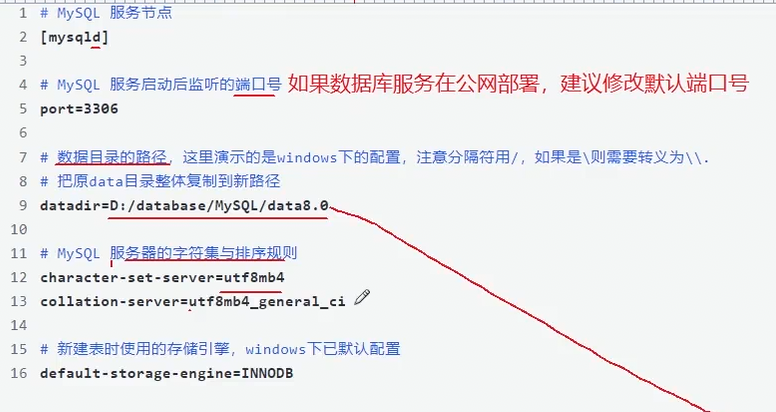
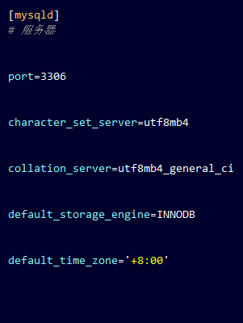

1.  查询mysql的数据目录

```shel
mysql> show variables like 'datadir';
+---------------+-----------------+
| Variable_name | Value           |
+---------------+-----------------+
| datadir       | /var/lib/mysql/ |
+---------------+-----------------+
1 row in set (0.01 sec)

mysql>
```

修改路径的时候 需要整体复制一下


2.  服务器配置




- 再配置一个时区
  -  东八时区



单引号和双引号等价


3. 

vim /etc/mysql/my.cnf

修改这个 文件 


4. 