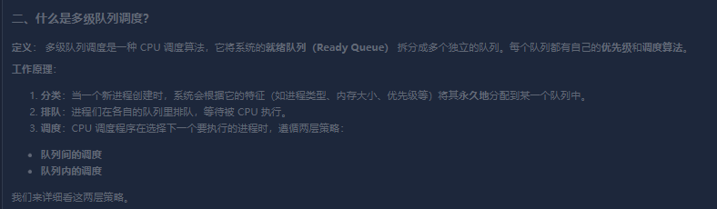

1. 物联网协议

- 简单利用
- 轻量高效
- 可靠的消息传递
- 海量连接支持
- 安全的双向通信
- 多平台支持

- [ ] 11_25


2. 详细介绍一下 mQTT协议
一种基于 发布/订阅 模式的 轻量级的消息传输协议

- [ ] 11_25


3. 
进程调度算法

- 先来先服务(FCFS)
  - 按照进程 到达 的先后顺序排列 调度器总是选择队首的进程
  
  
  
- 最短作业优先(SJF)

  - 优先调度预计运行时间最短的进程

  

- 时间片轮转(Round Robin - RR)

  - 将 CPU 时间划分为 一个个时间片 , 公平地分配给每个进程 ; 这是专门为分时系统设计的抢占式算法	

- [x] 11_19

- [ ] 11_25


- 多级队列调度
  - 


- [ ] 11_19


- 优先级调度(Priority Scheduling)
  - 为每一个进程分配一个优先级,调度器总是选择优先级最高的就绪进程


- [ ] 11_19


- 多级反馈队列调度
  - 设置多个队列，优先级从高到低，时间片从小到大。
  - 新进程首先进入最高优先级队列（时间片最小）。
  - 如果进程在一个时间片内完成，则离开系统。
  - 如果用完了时间片但仍未完成，则**降级**到下一个优先级的队列（时间片更长）。
  - 如果一个低优先级进程长时间等待，可以将其**提升**到更高优先级的队列（老化机制），防止饥饿。
  - 通常，I/O密集型进程会保持在高优先级队列，而CPU密集型进程会逐渐下降到低优先级队列

- [x] 11_19

- [ ] 


- 完全公平调度器
  - **思想**: 这是当前**Linux内核**中使用的默认调度算法。它抛弃了传统的时间片概念，追求一种极致的公平。
  - **实现**:
    1. 为每个进程维护一个**虚拟运行时间 (vruntime)**。
    2. 调度器总是选择**vruntime最小**的进程来运行。
    3. 进程运行得越多，其vruntime增长得越快。
    4. 通过这种方式，CFS确保每个进程获得的CPU时间比例是公平的，而不是简单地轮流运行固定时间。
  - **优点**:
    - **极致公平**: 调度决策精确到纳秒级别，没有传统时间片的概念。
    - **高效**: 使用红黑树来管理就绪进程，可以非常快地找到vruntime最小的进程。


- [x] 11_19
- [ ] 


2. 

std::endian
作用是什么

```c++
#include <iostream>
#include <bit> // 必须包含
void print_system_endianness() {
    if constexpr (std::endian::native == std::endian::little) {
        std::cout << "This system is Little-Endian." << std::endl;
    } else if constexpr (std::endian::native == std::endian::big) {
        std::cout << "This system is Big-Endian." << std::endl;
    } else {
        std::cout << "This system has a mixed Endianness." << std::endl;
    }
}
int main() {
    print_system_endianness();
}
```


`>>小端`

3. 

constexpr 
这个的作用是？

在编译代码的时候就把它算出来,然后把结果直接写进最终的程序里,就像一个已知的数字


4. 内存和运行时间设置


5. RTSP 协议：

- 是单向的
- 服务器 -> 客户端
- 是用来点播的 控制权完全在客户端手里


比如 你想在 平台上观看某个摄像头 (IPC) 的实时视频

a. 设备注册 (SIP) 角色 。 想你的平台 SIP服务器 发送 REGISTER 消息； 告诉平台我上线了 ，地址是多少?

- [ ] 11_20

b. 你通过 平台想要看视频，平台会向摄像头发送一个 INVITE信号

这个INVITE消息 就是 想要建立一个媒体会话，准备接受你的视频流

- [ ] 

c. 摄像头回复200ok，表示同意

- [ ] 11_20

d. 开始传输视频流 (RTP) 会话建立之后，摄像头开始通过 RTP 协议，将实时视频数据源源不断地发送给平台

- [ ] 

e. 如果 你想看 某个时间段的录像 平台会先用SIP的MESSAGE 查询一下 有没有相关的录像文件

- [ ] 

f. 查询到了之后 再次发送 INVITE 请求，请求体里面会有详细的播放参数

- [ ] 

g. 如果你在过程中进行拖动 平台通过 SIP的 INGO 信号 吧这些控制指令(Play Pause Seek 发送给摄像头)

- [ ] 

h. 摄像头 接收到 指令后 就会调整它发送的RTP流

- [ ] 


