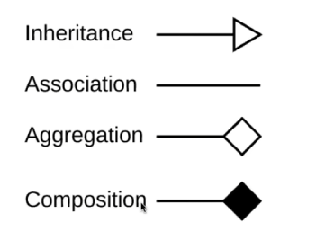

1. [git]

如何在 本地创建 测试 分支 并和 远程的测试分支 对接？


```sh
PS D:\PR\LosCpr> git fetch origin
From github.com:2932238802/LosCpr
 * [new branch]      dev/ui     -> origin/dev/ui
PS D:\PR\LosCpr> git branch
* main
PS D:\PR\LosCpr> git switch dev/ui
branch 'dev/ui' set up to track 'origin/dev/ui'.
Switched to a new branch 'dev/ui'
PS D:\PR\LosCpr> git branch
* dev/ui
  main
PS D:\PR\LosCpr>

这样就可以了 对嘛
```


- git fetch origin 就是 让本地的 Git 连接到 Github ; 

- 它会把新的分支信息下载下来，并在本地创建一个 **`orgin/<name>`** 远程 跟踪分支

- [ ] 11_24


2. [C++]

我认为 C++ 很大部分上 都是 各个类之间的 协作

所以 有什么 图 很适合 绘制 各个类之间的关系 ？ 像继承 多态 等

- [x] 11_24


3. [类图]




- [ ] 11_24


4. [Qt]

如何理解 这个 类 QGraphicsScene ？

- 是所有 故事 发生的空间
  - 有自己的坐标系 向右是X正半轴 向下是Y正半轴
  - 本身是无限大的 
  - 不关心 观众从哪个 角度看 管理 舞台上的一切

- [x] 11_25


5. [Qt]

铅笔绘制 ui 逻辑

```c++
// pencil_tool.h
#include "abstract_tool.h"
#include <QGraphicsPathItem>

class PencilTool : public AbstractTool {
public:
    void mousePressEvent(QMouseEvent *event, QGraphicsScene *scene) override;
    void mouseMoveEvent(QMouseEvent *event, QGraphicsScene *scene) override;
    void mouseReleaseEvent(QMouseEvent *event, QGraphicsScene *scene) override;
private:
    QGraphicsPathItem *m_pathItem = nullptr; // 当前正在绘制的路径
    QPainterPath m_path;
};

// pencil_tool.cpp
void PencilTool::mousePressEvent(QMouseEvent *event, QGraphicsScene *scene) {
    m_path = QPainterPath(event->pos()); // 创建新路径
    m_pathItem = scene->addPath(m_path, QPen(Qt::black, 2)); // 在场景中创建图元
}

void PencilTool::mouseMoveEvent(QMouseEvent *event, QGraphicsScene *scene) {
    if (m_pathItem) {
        m_path.lineTo(event->pos()); // 路径增加一个点
        m_pathItem->setPath(m_path); // 更新图元
    }
}

void PencilTool::mouseReleaseEvent(QMouseEvent *event, QGraphicsScene *scene) {
    m_pathItem = nullptr; // 绘制结束，清空指针
}

```

你详细介绍一下这个 绘制过程

m_path 是一个数组  或者说 容器 lineTo 会尾增？

setPath 相当于每次都要重新绘制 那不是很消耗性能？

- [ ] 11_24


- QPainterPath 
  - 元素列表  每个元素 包含两个部分 (类型和坐标)
    - 类型有  MoveToElement LineToElement CurveToElement
  - LineTo 就是尾增 O(1) 的时间复杂度

- [ ] 11_24


- 不会哦（针对 -> 那不是很消耗性能？）
  - 脏矩阵算法
    - 它会算出需要更新的最小矩形区域  路径末端增加的一小段线段周围的区域
  - 硬件加速
  - 双缓冲机制

- [ ] 11_24


m_pathItem
是图元对嘛
就是 直接 放入到 UI 界面的元素？

- m_pathItem 就是一个图元 但是 它 是放入 QGraphicsScene 这个逻辑容器里面

- [ ] 11_24


