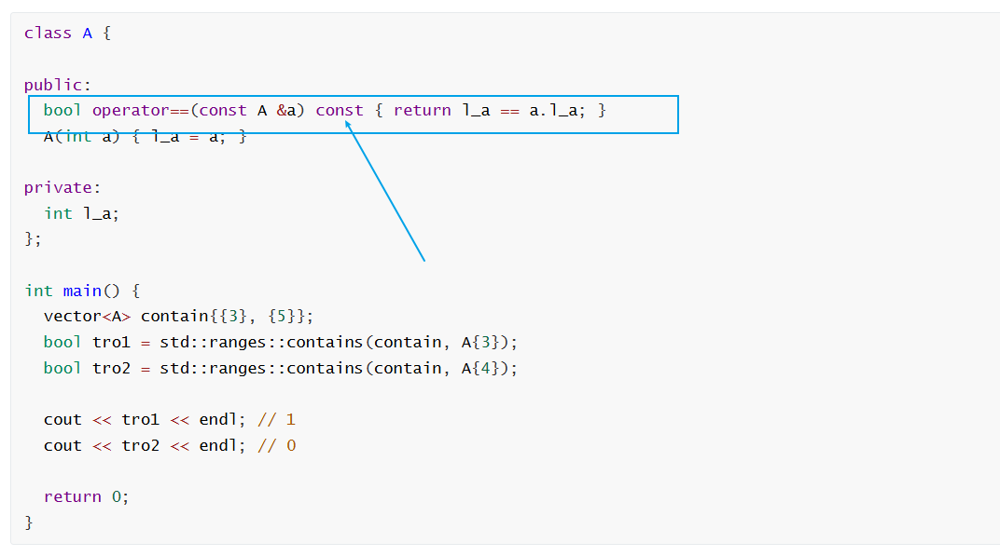

1.

```c++

class A {

public:
  bool operator==(const A &a) { return l_a == a.l_a; }
  A(int a) { l_a = a; }

private:
  int l_a;
};

int main() {
  vector<A> contain;

  std::ranges::contains(contain, A{4});

  return 0;
}

这个错误的原因是什么
```


```c++
class A {

public:
  bool operator==(const A &a) const { return l_a == a.l_a; }
  A(int a) { l_a = a; }

private:
  int l_a;
};

int main() {
  vector<A> contain{{3}, {5}};
  bool tro1 = std::ranges::contains(contain, A{3});
  bool tro2 = std::ranges::contains(contain, A{4});

  cout << tro1 << endl; // 1
  cout << tro2 << endl; // 0

  return 0;
}
```





2. 

```c++
struct Sum {

  int sum = 0;

  void operator()(const int &x) { sum += x; }
};

int main() {
  std::vector<int> contain{1, 3, 4, 5, 6};

  auto res = std::ranges::for_each(contain, Sum{});
}

```

如何理解这个res的返回值

ranges::in_fun_result

如何理解？


答：
这个 res的返回值 就是 **`std::ranges::in_fun_result`**

in是哪里停止了

fun 放进去的


```c++
struct Sum {
  int sum = 0;
  void operator()(const int &x) { sum += x; }
};

int main() {
  std::vector<int> contain{1, 3, 4, 5, 6};

  auto res = std::ranges::for_each(contain, Sum{});

  auto f = res.fun;
  cout << f.sum << endl;

  auto i = res.in;

  if (i == contain.end()) {
    cout << "已经到达了 结尾处了...";
  }
}

```

这里的 输出结果为:

PS D:\PR\LosCpr\test> ./run
19
已经到达了 结尾处了...


3. 

C++ 如何在代码里面
实现 控制台输出为 utf-8?

SetConsoleOutputCP

- [x] 11_25


4. SetConsoleOutputCP
   如何理解这个指令？

```c++
 SetConsoleOutputCP(CP_UTF8);
```

- Set 就是 设置 Console 就是 控制台 Output就是输出 CP就是代码页

- [x] 11_25


5. 

_WIN32 的真实含义是 你的程序正在为 WIN32 API 平台编译 
Win32 API 是Windows操作系统的核心应用程序 接口 

64 位 Windows 建立在 Win32 API的基础之上

- [x] 11_25


