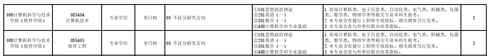
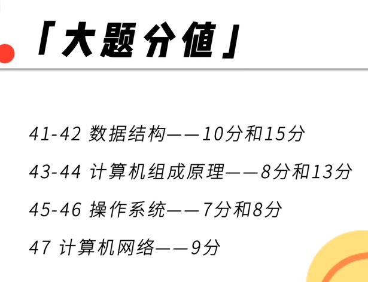
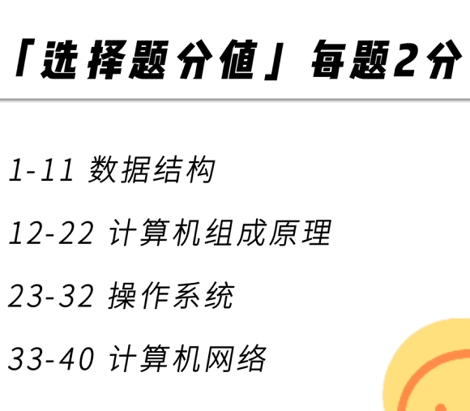
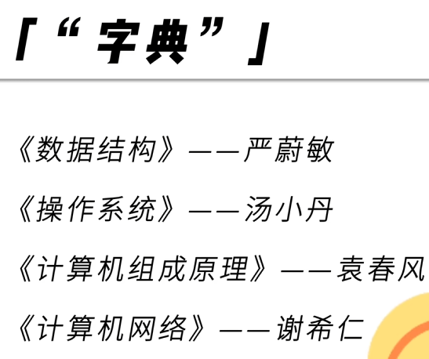

# 考研规划

## 重要时间点

- 10.10 - 10.13 报名时间

- 10.16 - 10.27 正式报名
- 11上旬 网上确认

- 12.20 - 12.21 考试时间左右

## 学校选择

### 最高目标 冲

### 中等目标 稳

### 保底目标 保

## 重要专业 

### 浙江工业大学
- 项目4：杭州市滨江区浙工大人工智能创新研究院
  - 计算机技术 2

- 项目5：拱墅区浙工大未来技术研究院
  - 计算机技术 3 
  - 软件工程 2
- 项目1：浙工大富阳科教人融合中心
  - 计算机技术 10
  - 软件工程  2

[硕士招生简章](http://www.yz.zjut.edu.cn/4303/list.htm)

[浙江工业大学2026年健行工程师专项专业学位研究生招生简章](http://www.yz.zjut.edu.cn/2025/0928/c4303a320379/page.htm)

[浙江工业大学2026年硕士研究生招生简章](http://www.yz.zjut.edu.cn/2025/0928/c4303a320350/page.htm)

###  

## 考试科目

### 408

#### 大题分值
- 

#### 选择题

#### 字典和书籍

## Ai 询问帮助结果·

- 如果是这几个 科目
  我应该如何 进行准备？
  从今年的 12月份到明年的 10月份
  我要如何做足了准备？

- 答：

- 第一阶段：基础夯实期 (2024年12月 - 2025年6月)

  **目标：** 完成所有科目的第一轮学习，理解基本概念，不留知识死角。

  | 科目           | 任务                                                         | 推荐资源                                                     |
  | -------------- | ------------------------------------------------------------ | ------------------------------------------------------------ |
  | **数学（一）** | 1. **过教材：** 仔仔细细地看一遍同济版《高等数学》、《线性代数》和浙大版《概率论与数理统计》，重点理解定义、定理和公式推导。   2. **跟课程：** 跟一位老师（如张宇、汤家凤）的基础班视频课程，建立完整的知识体系。   3. **做习题：** 完成教材的课后习题和基础阶段的习题集。 | 教材、张宇/汤家凤基础班视频、《张宇基础30讲》或《汤家凤1800题》（基础部分） |
  | **408专业课**  | 1. **过教材：** 逐一学习四门课的指定教材，建立初步印象。   2. **精读辅导书：** 以王道考研的四本单科辅导书为主，看一章，做一章的课后选择题。这是第一轮的核心。   3. **跟课程：** 配合王道或灰灰考研的视频课程，扫清理解障碍。 | 王道考研四本单科辅导书、《计算机网络（谢希仁版）》等经典教材、王道/灰灰考研视频 |
  | **英语（一）** | 1. **背单词：** 这是雷打不动的每日任务！用APP（如墨墨背单词）或单词书（如红宝书），每天1-1.5小时。目标是在6月底前至少过完第一遍。   2. **学语法/长难句：** 找一本语法书或跟一个长难句分析的课程（如田静），学会拆分句子结构。 | 《考研英语词汇闪过》（红宝书）、田静/刘晓艳语法长难句课程    |
  | **政治**       | **此阶段不学。** 现在开始太早，容易遗忘，且新大纲未出，效率极低。 | -                                                            |

- 第二阶段 2025年7月 - 8月

- | 科目           | 任务                                                         | 推荐资源                                                     |
  | -------------- | ------------------------------------------------------------ | ------------------------------------------------------------ |
  | **数学（一）** | 1. **二刷全书：** 快速过一遍强化阶段的辅导讲义，重点关注之前没搞懂和标记的重难点。   2. **主攻习题集：** 开始系统性地刷题，比如张宇的1000题或李永乐的660题，并且要总结错题。   3. **跟强化班：** 看强化阶段的视频课程，学习解题技巧和思路。 | 《张宇考研数学1000题》或《李永乐660题》、张宇/武忠祥强化班视频 |
  | **408专业课**  | 1. **二刷王道：** 重新做一遍王道单科书上的所有题目，特别是大题。   2. **构建框架：** 用思维导图等方式，将每门课的知识点串联起来，形成体系。例如，将操作系统的进程管理、内存管理、文件管理等联系起来。 | 王道四本单科辅导书（二刷）、自己的笔记和思维导图             |
  | **英语（一）** | 1. **主攻真题阅读：** 开始刷考研真题（建议从2005年开始）。精读每一篇文章，弄懂每一个单词和句子，分析每一个选项的对错原因。   2. **继续背单词：** 开始第二轮、第三轮单词复习，速度会越来越快。 | 《考研真相》或黄皮书系列真题、唐迟阅读视频                   |
  | **政治**       | 1. **开始第一轮：** 购买当年的新大纲和辅导书（如肖秀荣精讲精练）。   2. **跟课+做题：** 跟着徐涛或腿姐的强化班视频，学一章，做一章的练习题（如肖秀荣1000题）。 | 肖秀荣《精讲精练》+《1000题》、徐涛/腿姐强化班视频           |

- 第三阶段 (2025年11月 - 12月考前)

- | 科目           | 任务                                                         | 推荐资源                                               |
  | -------------- | ------------------------------------------------------------ | ------------------------------------------------------ |
  | **数学（一）** | 1. **开刷真题：** 开始做历年真题套卷（建议从2000年开始），每周1-2套，严格按照3小时时间进行模拟。   2. **分析总结：** 做完后认真分析，把错题归纳到错题本，回到讲义中重新学习对应的知识点。 | 《张宇考研数学真题大全解》或《李永乐数学历年真题解析》 |
  | **408专业课**  | 1. **开刷真题：** 这是408复习的重中之重！把历年408真题（从2009年至今）至少刷2-3遍。第一遍可以按章节刷，第二、三遍按套卷刷。   2. **反复纠错：** 408的考点重复率很高，真题中的每一个知识点都要彻底搞懂。 | 408历年真题、王道《历年真题精析》                      |
  | **英语（一）** | 1. **二刷真题：** 对已经做过的真题进行二刷，重点关注新题型、翻译和完形填空。   2. **启动作文：** 开始背诵优质作文模板和语料，并尝试自己仿写。每周至少写一篇。 | 历年真题（二刷）、王江涛《考研英语高分写作》           |
  | **政治**       | 1. **二刷1000题：** 快速过第二遍1000题，重点看错题。   2. **关注时政：** 开始留意当年的时事政治。 | 肖秀荣《1000题》（二刷）、各类公众号总结的时政热点     |

## 考研自我时间规划

### 考研打卡表：

11_28： 预备考研 ; 写了相关的信息 ;

