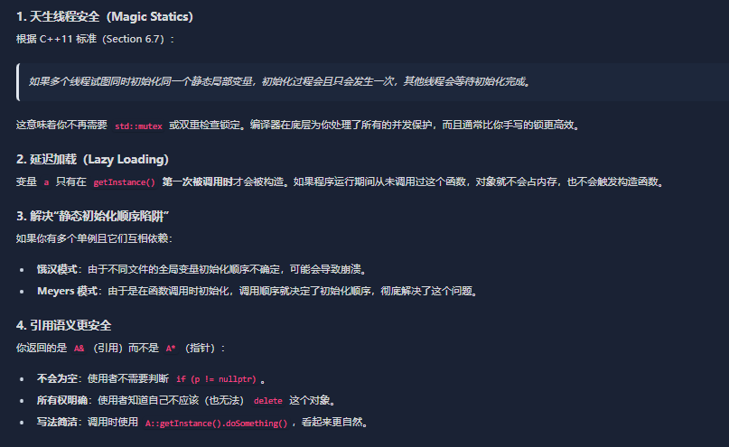

1. Qt QLabel
   如何设置字体水平居中？

- ```c++
  // 使用setAlignment()方法
  label->setAlignment(Qt::AlignCenter);  // 水平和垂直都居中
  
  // 或者只水平居中
  label->setAlignment(Qt::AlignHCenter | Qt::AlignVCenter);
  ```


---


2. [Qt]

```c++
LoadingOverlay::LoadingOverlay(QWidget* parent)
	:QWidget(parent)
{
	this->setAttribute(Qt::WA_TransparentForMouseEvents);
	this->setAutoFillBackground(true);
}

如何理解 这两个set？
```

- 对鼠标事件透明
  - **鼠标事件穿透**：鼠标点击、移动、释放等事件会直接穿透这个部件，传递给下面的部件
  - **不会拦截事件**：该部件不会处理任何鼠标事件，也不会阻止下层部件接收这些事件
  - **不影响子部件**：如果该部件有子部件，子部件仍然可以接收鼠标事件
- 自动填充部件的背景


3. [Qt]

```c++

LoadingOverlay::LoadingOverlay(QWidget* parent)
	:QWidget(parent)
{
	this->setAttribute(Qt::WA_TransparentForMouseEvents);
	this->setAutoFillBackground(true);

	// 调色板
	QPalette pal = palette();
	pal.setColor(QPalette::Window, QColor(0, 0, 0, 120));
	this->setPalette(pal);

	HS_loadingLabel = new QLabel(this);
	HS_movie = new QMovie(ICON_PATH::LOADING_LABEL);

	if (HS_movie->isValid())
	{
		HS_loadingLabel->setMovie(HS_movie);
		HS_movie->start();
		HS_loadingLabel->setScaledContents(true);
		HS_loadingLabel->setFixedSize(64, 64);
	}
	else {
		HS_loadingLabel->setText("Loading...");
		HS_loadingLabel->setStyleSheet("color: white; font-weight: bold;");
	}
}

我有个问题：
1. 这里movie start？什么意思 问题是 转动的动画都没给它初始化啊？
```


- `QMovie` 本身就是那个“转动的动画”


4. [Qt]

Q_PROPERTY
这个作用是什么？


- 

所以整个代码代用关系是这样的：

```c++
#include "ui/HsLoadingOverlay/LoadingOverlay.h"


LoadingOverlay::LoadingOverlay(QWidget* parent)
	:QWidget(parent)
{
    this->setAttribute(Qt::WA_TransparentForMouseEvents, false); // 拦截鼠标
    this->setAutoFillBackground(true);
    QPalette pal = palette();
    pal.setColor(QPalette::Window, QColor(0, 0, 0, 150)); // 黑色，透明度150
    this->setPalette(pal);

    QHBoxLayout* layout = new QHBoxLayout(this);
    layout->setAlignment(Qt::AlignCenter);

    spinner = new SpinWidget(this);
    spinner->setFixedSize(80, 80);
    spinner->setImage(":/icons/loading_icon.png");

    layout->addWidget(spinner);

    anim = new QPropertyAnimation(spinner, "angle", this);
    anim->setDuration(1200);
    anim->setStartValue(0);
    anim->setEndValue(360);
    anim->setLoopCount(-1);
    this->hide();
}


/// <summary>
/// 1_21
/// 展示 旋转
/// </summary>
void LoadingOverlay::showLoading() {
    this->raise();
    this->show();
    anim->start();
}


/// <summary>
/// 1_21
/// 掩藏 旋转
/// </summary>
void LoadingOverlay::hideLoading() {
    anim->stop();
    this->hide();
}


/// <summary>
/// 1_21
/// - 跟着父组件运动
/// </summary>
/// <param name="event"></param>
void LoadingOverlay::resizeEvent(QResizeEvent* event)
{
    this->resize(this->parentWidget()->size());
    QWidget::resizeEvent(event);
}


/// <summary>
/// 
/// </summary>
/// <param name="">
/// 
/// </param>
void LoadingOverlay::mousePressEvent(QMouseEvent*)
{
}


/// <summary>
/// 1_21
/// - 创建
/// </summary>
/// <param name="parent">
/// 
/// </param>
explicit SpinWidget::SpinWidget(QWidget* parent = nullptr) : QWidget(parent) {
    setFixedSize(64, 64);
}


/// <summary>
/// 
/// </summary>
/// <param name="path">
/// 
/// </param>
void SpinWidget::setImage(const QString& path) {
    HS_pixmap = QPixmap(path);
    update();
}


/// <summary>
/// 
/// </summary>
/// <returns></returns>
int SpinWidget::angle() const { return HS_angle; }


/// <summary>
/// 1_21
/// 设置角度
/// </summary>
/// <param name="a">
/// 
/// </param>
void SpinWidget::setAngle(int a) {
    HS_angle = a % 360;
    update();
}


void SpinWidget::paintEvent(QPaintEvent*){
    if (HS_pixmap.isNull()) return;

    QPainter p(this);
    p.setRenderHint(QPainter::Antialiasing);
    p.setRenderHint(QPainter::SmoothPixmapTransform);

    p.translate(width() / 2, height() / 2); 
    p.rotate(HS_angle);                     
    p.translate(-width() / 2, -height() / 2); 

    int s = qMin(width(), height()); 
    int x = (width() - s) / 2;
    int y = (height() - s) / 2;
    p.drawPixmap(x, y, s, s, HS_pixmap);
}


```


    1. 外界让它 适应一个动画之后
    2. 这个动画  anim = new QPropertyAnimation(spinner, "angle", this);
    3. 这个动画的名字叫做 angle
    4. 然后启动的时候 
    5. 就会根据这个组件里面的 Qproperty 去找一个angle
    6. 因为定义了 Q_PROPERTY(int angle READ angle WRITE setAngle)
    7. 所以setStartValue 和 setEndValue 都是会调用 setAngle
    8. 然后setAngle又会 触发 update 所以 就会 旋转起来对么


---


5. [Qt] [c++]

C++的各种单例 模式 我要重新复习一遍
你带我复习一遍
各种单例模式的设计


- 懒汉模式 - 基础版本

```c++
class A{
private:
    static A* instance;
    A() {};

public:

    A(const A&a) = delete;
    A& operator=(const A&) = delete;
    static A* getInstance(){
        
        if(nullptr == instance)
        {
            instance = new A();
        }
        return instance;
    }
};
A* A::instance = nullptr;
```

- [x] 1_21


- 懒汉模式 - 线程安全

```c++
class A{
private:
    static A* instance;
    static std::mutex mtx;

    A() {};

public:

    A(const A&a) = delete;
    A& operator=(const A&) = delete;
    static A* getInstance(){
        
        if(nullptr == instance)
        {
            instance = new A();
        }
        return instance;
    }
};
A* A::instance = nullptr;
std::mutex A::mtx;
```


- 饿汉模式 - 天生线程安全

```c++
class A {
private:
  static A *instance;
  A() {};

public:
  static A *getInstance() { return instance; }

  A &operator=(const A &) = delete;
  A(const A &) = delete;
};

A *A::instance = new A();
```

如果你有另一个全局对象 `B`，在 `B` 的构造函数里调用了 `A::getInstance()`，由于 C++ 不保证不同文件间全局变量的初始化顺序，可能导致 `B` 初始化时 `A::a` 还是个野指针或空指针，从而导致程序崩溃


- **局部静态变量 (Local Static Variable) 的初始化是线程安全的**。编译器会自动在底层加锁，保证只会初始化一次

- Meyers’ Singleton

```c++
class A {
private:
  A() {};
  ~A() {};

public:
  A(const A &) = delete;
  A &operator=(const A &) = delete;

  static A &getInstance() {
    static A a;							// 程序结束的时候 才会销毁
    return a;
  }
};
```





