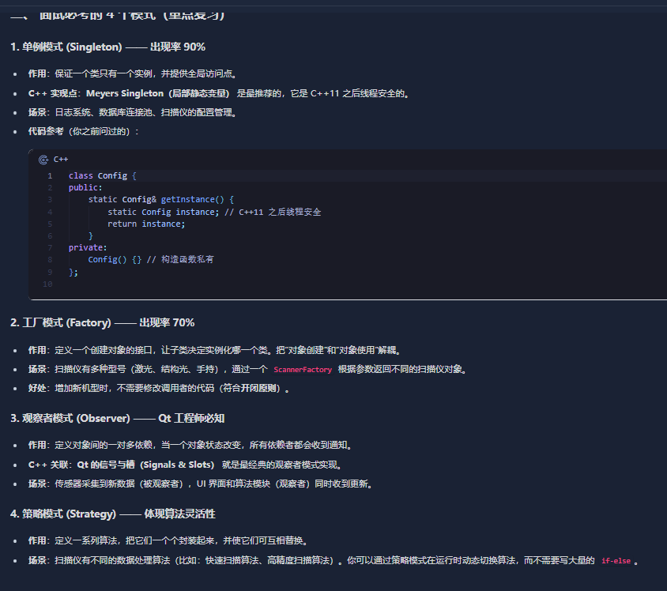

- condition_variable

```c++
#include <iostream>
#include <thread>
#include <mutex>
#include <condition_variable>

std::mutex mtx;
std::condition_variable cv;
int state = 0; 

void printLetter(char c, int target_state) {
    for (int i = 0; i < 10; ++i) { 
        std::unique_lock<std::mutex> lock(mtx);
        cv.wait(lock, [target_state] { return state == target_state; });
        std::cout << c;
        state = (state + 1) % 3;
        cv.notify_all();
    }
}

int main() {
    std::thread t1(printLetter, 'A', 0);
    std::thread t2(printLetter, 'B', 1);
    std::thread t3(printLetter, 'C', 2);
    t1.join();
    t2.join();
    t3.join();
    std::cout << std::endl;
    return 0;
}
```

 对于这个 代码里面的 详细介绍一下 这个 wait函数 notify_all?


- #### 判断“入睡”条件（谓词 Predicate）

  - `wait` 首先执行 Lambda 表达式 `[] { return state == target_state; }`。
  - **如果返回 `true`**：线程认为条件满足，**不阻塞**，直接向下执行。
  - **如果返回 `false`**：线程进入第 2 步。

- [x] 26_1_30


- 原子性的“放锁 + 睡觉” (关键！)

  - 线程会自动做两件事：**释放 `mtx` 互斥锁**，同时把自己的**线程挂起（阻塞）**，进入等待队列。
  - **为什么要放锁？** 如果它不放锁就去睡觉，别的线程就永远拿不到锁，也就没法修改 `state`，这就死锁了。
  - **为什么要原子性？** 为了保证在“决定睡觉”和“真正睡着”之间，不会错过任何通知。

- [x] 26_1_30


- - - 23

- [x] 26_1_29


醒来后的“抢锁”

- 当其他线程调用 `notify_all()` 时，这个线程被唤醒。
- **醒来后的第一件事不是打印**，而是**重新竞争 `mtx` 锁**。
- 只有抢到了锁，`wait` 才会再次执行 Lambda 表达式：
  - 如果条件依然不满足（虚假唤醒），它会重复第 2 步（放锁接着睡）。
  - 如果条件满足，`wait` 彻底结束，代码向下执行

对于 这个 逻辑 我还有点问题
这个 重新竞争锁的这个 逻辑 是哪个函数 或者 哪段代码体现的？

- 是由 wait函数的内部 执行的

  - `cv.wait` 醒来后重新竞争锁的逻辑是**封装在 `wait` 函数内部实现的**。

    当 `wait` 被唤醒时，它首先会在函数内部尝试对传入的 `unique_lock` 重新执行 `lock()` 操作。只有在成功抢到互斥锁之后，它才会去重新评估 Lambda 表达式（谓词）。

    如果抢锁失败，线程会在 `wait` 内部阻塞等待锁。如果抢到锁但条件不满足（虚假唤醒），它会再次释放锁并进入睡眠。只有**抢锁成功**且**条件满足**，`wait` 才会返回，保证了 `wait` 之后的代码块始终是在互斥锁的保护下运行的。

- [ ] 26_1_29

1. [C++]

list 的学习


```c++
    std::vector<int> contain{1,2,3};
    std::list<int> list_(contain.begin(),contain.end());
```

- 可以通过 其它迭代器进行构造

- [x] 26_2_1


```c++
auto it1 = vec.begin() + 3;      // 正确
auto it2 = vec.begin();
std::advance(it2, 3);            // 正确

// 对于双向迭代器，只能用advance
// auto it3 = lst.begin() + 3;  

为啥这个编译错误？
```

- 因为 这个 `std::list`, `std::set`, `std::map` 是双向迭代器
  - 非连续内存（链表节点、红黑树节点）
  - 只支持 `++`, `--`。**不支持 `+` 和 `-`**
  - 链表节点散落在内存各处。要找到第 3 个节点，必须从当前位置开始，沿着 `next` 指针一个一个跳
- ***O\*(\*n\*)**


```C++
template <class InputIterator, class Distance>
void advance(InputIterator& it, Distance n);
```

- advance

- ```c++
  auto it = lst.begin();
  std::advance(it, 3); // it 现在指向第四个元素
  ```

- ```c++
  auto it = std::next(lst.begin(), 3); // 相当于 it = lst.begin() + 3
  ```


```c++
    for(auto a: list_)
    {
        std::cout << a << " ";
    }    
    std::cout << std::endl;

    // 0 10 1 2 3 3 -1
    auto next = std::next(list_.begin() , 3);
    // 输出了 2
```

- std::next 的使用


2. 

<<<<<<< HEAD
```c++
#include <iostream>
#include <thread>
#include <semaphore> // C++20 标准

// 定义三个信号量
// semA 初始值为1（先开始），其他为0
std::counting_semaphore<1> semA(1);
std::counting_semaphore<1> semB(0);
std::counting_semaphore<1> semC(0);

void printA() {
    for (int i = 0; i < 10; ++i) {
        semA.acquire(); // 等待 A 信号
        std::cout << "A";
        semB.release(); // 释放 B 信号
    }
}

void printB() {
    for (int i = 0; i < 10; ++i) {
        semB.acquire();
        std::cout << "B";
        semC.release();
    }
}

void printC() {
    for (int i = 0; i < 10; ++i) {
        semC.acquire();
        std::cout << "C";
        semA.release();
    }
}

int main() {
    std::thread t1(printA);
    std::thread t2(printB);
    std::thread t3(printC);

    t1.join();
    t2.join();
    t3.join();
    return 0;
}

如何理解 
这个 sem 是 0 还是 1
难道 是1 就是可以还是说 > 1就可以？

unordered_map 如何 判断一个键值对 存不存在？

- ```c++
  std::unordered_map<int, std::string> map = {{1, "apple"}, {2, "banana"}};
  
  auto it = map.find(1); 
  if (it != map.end()) {
      // 存在
      std::cout << "找到了: " << it->second << std::endl;
  } else {
      // 不存在
      std::cout << "没找到" << std::endl;
  }

- 常规的find思路


```c++
if (map.contains(1)) {
    // 存在
}

```

- 这个思路 如果 要取出 对应的 value 还要 两次 哈希计算


```c++
if (map.count(1)) {
    // 存在 (count 返回 1，逻辑为真)
}
```

- 最简单的方式


3. 

详细介绍一下 C++的 list的 splice？

```c++

```

- 拨弄四个指针的 指向
  - 只是在链表中的逻辑顺序发生改变了
  - void splice(const_iterator pos, list& other);
    - 将 `other` 里的所有元素剪切，粘贴到当前 list 的 `pos` 之前。
  - void splice(const_iterator pos, list& other, const_iterator it);
    - 将 `other` 中由 `it` 指向的那个元素剪切，粘贴到当前 list 的 `pos` 之前。
  - void splice(const_iterator pos, list& other, const_iterator first, const_iterator last);
    - 将 `other` 中 `[first, last)` 范围内的元素剪切，粘贴到当前 list 的 `pos` 之前

- [x] 26_2_5


4. LRU的缓存这个 怎么写

```c++
#include <unordered_map>
#include <list>
#include <iostream>
#include <utility>

class LRUCache {
    int capacity;
    std::list<std::pair<int, int>> list_;
    std::unordered_map<int, std::list<std::pair<int, int>>::iterator> map_;

public:
    LRUCache(int capacity) : capacity(capacity) {}
    
    int get(int key) {
        auto it = map_.find(key);
        if (it == map_.end()) {
            return -1;
        }
        
        list_.splice(list_.begin(), list_, it->second);
        
        return it->second->second;
    }
    
    void put(int key, int value) {
        auto it = map_.find(key);
        
        if (it != map_.end()) {
            it->second->second = value;
            list_.splice(list_.begin(), list_, it->second);
            return;
        }

        if (list_.size() == capacity) {
            int last_key = list_.back().first;
            map_.erase(last_key);
            list_.pop_back();
        }

        list_.emplace_front(key, value);
        map_[key] = list_.begin();
    }
};
```


5. vector 初始化 unordered_map

```c++
#include<vector>
#include<unordered_map>

int main(){

    std::vector<int> contain{1,3,5};
    std::unordered_map<int, int> map_(contain.begin(),contain.end());
    return 0;
}

map_ 里面每个值都是0么？

```


<<<<<<< HEAD
- 信号量内部维护一个**计数器（Counter）**：
  - **`acquire()` (请求令牌)**：
    - 如果 计数器 **> 0**，就把计数器 **减 1**，然后线程继续往下走。
    - 如果 计数器 **== 0**，线程就**原地睡觉（阻塞）**，直到有人把计数器变大。
  - **`release()` (归还令牌)**：
    - 把计数器 **加 1**。
    - 如果有线程正在睡觉等这个信号量，叫醒它

- [ ] 26_1_29


counting_semaphore
为什么 要 <1> ?
如何理解？

- `<1>` 定义了该信号量的**“容量上限**

- [x] 26_1_29


3. 常规的 CMakeLists的编写

```cmake
cmake_minimum_required(VERSION 3.8)

project(MyApp VERSION 1.0 LANGUAGES CXX)

set(CMAKE_CXX_STANDARD 20)
set(CMAKE_CXX_STANDARD_REQUIRED ON)

add_executable(test test.cpp)
find_package(Threads REQUIRED)
target_link_libraries(test PRIVATE Threads::Threads)

```

- [x] 26_1_29


4. [C++]

shared_ptr 引用计数增加是线程安全的吗 

#### 既然 `shared_ptr` 有性能开销，那如何优化它的性能？

- **标准回答**：尽量使用 **`std::make_shared`** 而不是 `new`。
- **原因**：
  1. **性能**：`make_shared` 只执行一次内存分配（对象和控制块连在一起分配），而 `new` 会触发两次（对象一次，控制块一次）

- [x] 26_1_29


5. [C++]

子类和父类构造函数的顺序

- 构造执行顺序：由父及子

- 父类构造函数 先执行。

- 子类成员变量（如果在初始化列表里）初始化。

- 子类构造函数 体内部的代码 后执行

- [ ] 26_1_29


6. [net]

https加密过程 
tcp 的滑动窗口


- HTTPS = HTTP + SSL/TLS
  - **客户端发起请求**
    - 客户端给服务器发送自己支持的加密算法版本和一个**随机数 (Random1)**
  - **服务器响应**
    - 服务器确认加密算法，发送自己的 **数字证书**（包含服务器的**公钥**）和另一个**随机数 (Random2)**
  - **客户端验证与密钥交换**
    - 客户端验证证书有效性(通过浏览器内置的 CA 机构)
    - 验证通过后，客户端生成第三个**随机数 (Pre-master secret)**，并用服务器的**公钥**加密后发给服务器
  - **生成最终对称密钥**
    - 服务器用自己的**私钥**解密，得到第三个随机数。
    - 现在双方都有了 Random1、Random2、Pre-master，双方通过这三个数计算出同一个**“会话密钥” (Session Key)**。
    - **后续所有的通信都用这个“会话密钥”进行对称加密**

- [x] 26_1_30


###  TCP 的滑动窗口 (Sliding Window)

**核心作用**：**流量控制**。防止发送方发得太快，导致接收方缓冲区溢出。

**面试标准回答：**

1. **定义**： TCP 连接的双方都有一个缓冲区。接收方会告诉发送方：“我现在的处理能力还有多少（Window Size）”，发送方根据这个数值来决定发多少数据。
2. **工作原理**：
   - **发送窗口**：包含“已发送但未确认”和“允许发送但尚未发送”的数据。
   - **接收窗口**：包含“允许接收”的空间。
   - **动态调整**：当接收方处理数据变慢，它会在 ACK 包里把 `Window` 字段改小；当它处理完了，就把 `Window` 调大。发送方据此“滑动”它的发送窗口。
3. **停止等待 (Zero Window)**： 如果接收方缓冲区满了，Window 会变成 0，发送方停止发送，直到接收方发送窗口更新通知。

** 追问：滑动窗口和拥塞控制的区别？**

- **答**：
  - **滑动窗口**是管“对面能不能收得下”（点对点）。
  - **拥塞控制**是管“网络路段堵不堵”（全局）

- [x] 26_1_30


7. 哈希表的原理 是什么

**利用“哈希函数”将“键 (Key)”映射到“数组”的一个下标，从而实现** **O(1)\*O\*(1)** 时间复杂度的快速查找

- [x] 26_1_30


8. 7层模型+TCP； 应表会传网数物

- **应用层 (Application)**：直接为用户提供服务。

- *协议：HTTP, FTP, DNS, SMTP*

- **表示层 (Presentation)**：数据的格式化、加密、压缩。

- *功能：LZO/ZIP压缩, SSL/TLS加密*

- **会话层 (Session)**：建立、管理、终止会话。

- *功能：断点续传、自动收发确认*

- **传输层 (Transport)**：定义端到端的数据传输控制。**（最重要）**

- *协议：**TCP**, **UDP***

- **网络层 (Network)**：选择最佳路由，逻辑寻址。

- *协议：**IP**, ICMP, ARP*

- **数据链路层 (Data Link)**：将比特流封装成帧，物理寻址（MAC地址）。

- *设备：交换机*

- **物理层 (Physical)**：通过物理介质传输比特流（0和1）。

- *设备：网线、集线器*


9. 

#### 1. 三次握手 (Establish Connection)

- **过程**：
  1. 客户端发送 **SYN**（问：能建连接吗？）。
  2. 服务器发送 **SYN + ACK**（答：可以，我准备好了）。
  3. 客户端发送 **ACK**（答：好的，那我们开始吧）。
- **为什么是三次？**
  - 为了确认**双方**的**接收**和**发送**能力都是正常的，防止失效的连接请求突然传到服务器产生错误。

#### 2. 四次挥手 (Terminate Connection)

- **过程**：
  1. 客户端发 **FIN**（说：我发完了）。
  2. 服务器发 **ACK**（说：知道了，但我可能还没发完，你等会）。
  3. 服务器发完后，发 **FIN**（说：我也发完了，可以关了）。
  4. 客户端发 **ACK**（说：好的，再见），然后进入 **TIME_WAIT** 状态。
- **为什么是四次？**
  - 因为 TCP 是**全双工**的。一端关闭连接时，另一端可能还在发数据，所以不能像握手那样合在一起发，必须等对方也同意关闭。

#### 3. TCP 如何保证可靠性？

面试官问“TCP 为什么可靠”时，回答这 5 个词：

1. **校验和**（检查数据坏没坏）。
2. **序列号/确认应答 (ACK)**（保证不丢包、不乱序）。
3. **超时重传**（丢包了自动重发）。
4. **流量控制 (滑动窗口)**（防止发太快把对方淹没）。
5. **拥塞控制**（防止网络太堵）。

- [ ] 26_1_29


10. 

信号量与条件变量的区别

| 特性             | 信号量 (Semaphore)           | 条件变量 (Condition Variable)         |
| :--------------- | :--------------------------- | :------------------------------------ |
| **内部状态**     | 有（计数器）                 | 无（仅是通知）                        |
| **是否需配合锁** | 不需要                       | 必须配合 `std::mutex`                 |
| **信号丢失**     | 不会（信号会保存在计数器里） | 会（如果没有线程在 wait，信号就没了） |
| **主要用途**     | 管理有限的资源数量（PV操作） | 等待某个特定逻辑条件成立              |
| **典型代表**     | 停车位管理                   | 生产者-消费者（队列空/满判断）        |


11. 

### 几个核心原则（面试官更看重这个）

如果你记不住具体的模式，说出这几个原则（SOLID）也能拿高分：

1. **开闭原则 (OCP)**：对扩展开放，对修改关闭。
2. **单一职责原则 (SRP)**：一个类只负责一件事。
3. **依赖倒置原则 (DIP)**：要依赖于抽象（接口），不要依赖于具体实现

- [ ] 26_1_29


12. 


=======

