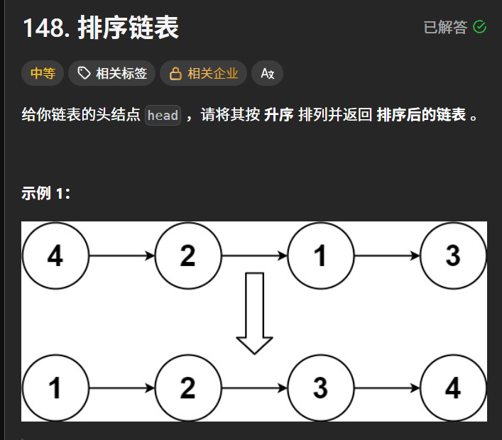

1. 

priority_queue
详细介绍一下

- ```c++
  template<
      class T,
      class Container = std::vector<T>,
      class Compare = std::less<typename Container::value_type>
  > class priority_queue;
  ```

- [ ] 26_1_30


- **T**：数据类型（如 `int`, `double`, `MyStruct`）。
- **Container**：底层存储容器。必须是支持随机访问的容器，默认是 `std::vector`（也可以用 `std::deque`，但 `vector` 效率更高）。
- **Compare**：比较规则。
  - `std::less<T>`（默认）：**大顶堆**（大的先出）。
  - `std::greater<T>`：**小顶堆**（小的先出）

- [ ] 26_1_30


2. 

```c++
std::priority_queue<int> pq1; 
```

- 大顶堆

- [ ] 26_1_30


```c++
int main() {
  std::priority_queue<int> p1;

  p1.push(3);
  p1.push(1);
  p1.push(2);

  std::cout << p1.top() << std::endl;
  // 默认 从大到小
}
```

- 默认是大堆

- [ ] 26_1_30


如何 打印 priority_queue?

```c++
#include <functional>
#include <iostream>
#include <queue>

template <class T, class contain, class Compare>
class MyPri : public std::priority_queue<T, contain, Compare> {
public:
  void Print() {
    for (auto a : this->c) {
      std::cout << a << " ";
    }
  }
};

int main() {
  MyPri<int, std::vector<int>, std::greater<int>> my_pri;
  my_pri.push(1);
  my_pri.push(4);
  my_pri.push(3);
  my_pri.push(2);
  my_pri.Print();
}

现在树的结构长什么样
```

- 只能这样的 访问底层的 vector

- ```tex
        1
       / \
      4   3
  
  ```

- ```tex
        1
       / \
      4   3
     /
    2  <-- 新加入的
  ```

- ```tex
        1
       / \
      2   3
     /
    4 
  ```

- [ ] 26_1_30


3. 

```tex
152. 乘积最大子数组
     已解答
     中等
     相关标签
     premium lock icon
     相关企业
     给你一个整数数组 nums ，请你找出数组中乘积最大的非空连续 子数组（该子数组中至少包含一个数字），并返回该子数组所对应的乘积。

测试用例的答案是一个 32-位 整数。
请注意，一个只包含一个元素的数组的乘积是这个元素的值。
示例 1:

输入: nums = [2,3,-2,4]
输出: 6
解释: 子数组 [2,3] 有最大乘积 6。
示例 2:

输入: nums = [-2,0,-1]
输出: 0
解释: 结果不能为 2, 因为 [-2,-1] 不是子数组。

这个我这种做法 是不是 太慢了
有没有更好的办法？
```

```c++
class Solution {
public:
    int maxProduct(vector<int>& nums) {
        int size_ = nums.size();
        int max_ = nums[0];
        for(int i = 0 ; i < size_ ; i++)
        {
            int  temp = 1;
            for(int j = i; j < size_ ; j++)
            {
                // 下一位
                temp = temp * nums[j];
                max_ = max(max_ , temp);
            }
        }
        return max_;
    }
};

```


4. 




