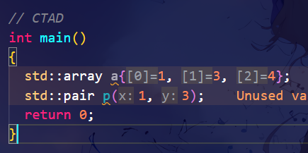

1. [c++]

```c++
int func([[maybe_unused]] int x, int y) { return y; }
int main()
{
  std::cout << func(1, 2);

  // 2
  return 0;
}
```


2. [c++]

```c++
int main()
{
  std::array<int, 5> contain{};
  contain[1] = 2;

  auto Print = [](const std::array<int, 5> &contain)
  {
    for (auto a : contain)
    {
      std::cout << a << " ";
    }
    std::cout << std::endl;
  };

  Print(contain);
  contain.fill(3);
  Print(contain);
  std::cout << contain.size() << std::endl;

  contain = std::to_array({1, 3, 4, 5, 9});
  Print(contain);

  // 统计 count_if
  int number = std::count_if(contain.begin(), contain.end(),
                             [](int x) { return x > 4; });
  std::cout << number << std::endl;

  try
  {
    std::cout << contain.at(5) << std::endl;
  }
  catch (std::out_of_range)
  {
    std::cout << "越界了" << std::endl;
  }

  // 0 2 0 0 0
  // 3 3 3 3 3
  // 5
  // 1 3 4 5 9
  // 2
  // 越界了

  return 0;
}
```

- [x] 26_2_23


3. 

啥是 CTAD ？

- 类模板参数推导




4. [c++]

nullopt 和 nullptr 的区别？

- optional 的空状态指示器
- 用于 表示 一个 std::optional 容器中没有值


5. [c++]

```c++
// optional
int main()
{
  std::optional<std::string> s = "1234";
  if (s)
  {
    std::cout << s.value() << std::endl;
  }

  if (s.has_value())
  {
    std::cout << s.value() << std::endl;
  }

  // reset;
  s.reset();
  if (!s)
    std::cout << "s 内部无值" << std::endl;

  // value_or
  s.reset();
  std::string s2 = s.value_or("4321");
  std::cout << s2 << std::endl;

  // swap
  std::optional<std::string> sChange = std::nullopt;
  s = "12";
  sChange.swap(s);

  std::cout << s.value_or("s 是空") << std::endl;
  std::cout << sChange.value_or("sChange 也是空的") << std::endl;

  return 0;
}
```

optional 的使用


6. [c++]

```c++

int main()
{
  std::array<int, 3> contain{1, 2, 3};
  auto [a, b, c]{contain};

  // std::vector<int> containVec{3, 2, 1};
  // auto [d, e, f]{containVec}; // 这个是不行的 因为 参数数量 不固定

  struct CoM
  {
    int a;
    int b;
    int c;
  };

  CoM com;
  com.a = 1;
  com.b = 2;
  com.c = 3;
  auto [x1, x2, x3]{com};

  return 0;
}
```


