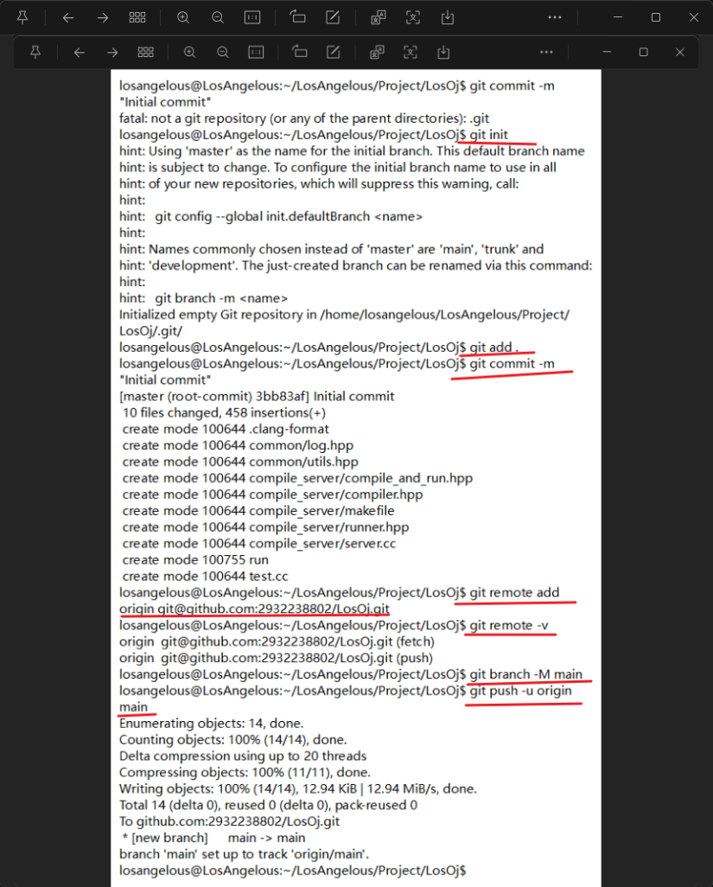

1. mysql.exe 是mysql的客户端程序 用于交互式输入sql或以批量处理模式从文件执行sql的命令行工具

2. 

3.  git 的提交

- git branch -M 就是强制分支 命名为 

- [x] 11_17
- [ ] 

4. mysqld 

- [ ] 11_17
- [ ] 

5. 
其实 我有一个问题
mysqld这个服务器 是在远程还是部署在本地

| 特性         | 部署在本地                    | 部署在远程                   |
| :----------- | :---------------------------- | :--------------------------- |
| **位置**     | `mysqld` 和客户端在同一台电脑 | `mysqld` 和客户端在不同电脑  |
| **连接地址** | `localhost` 或 `127.0.0.1`    | IP 地址或域名                |
| **用途**     | 开发、学习、个人项目          | 生产环境、数据共享、网站后台 |
| **网络**     | 不需要网络，通过内部环回      | 必须通过局域网或互联网       |

