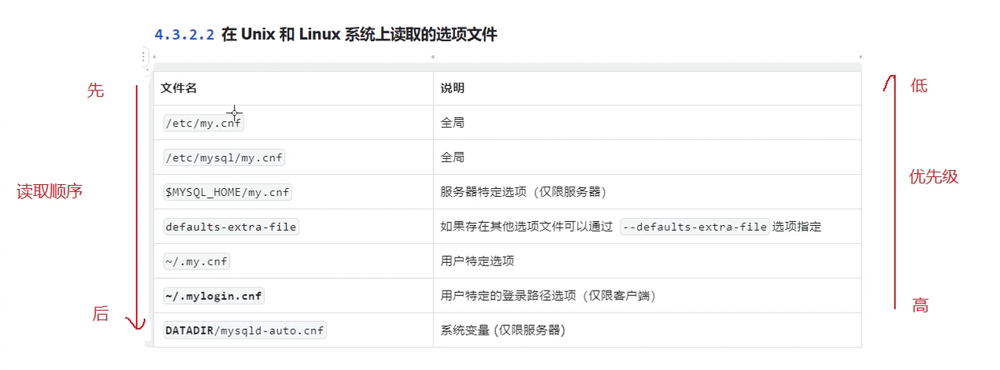

1. 快捷方式 也叫做 软连接

- Linux

- [x] 11_13

2. `[mysqld]`
`#`
`# * Basic Settings`
`#`
`user            = mysql`
`# pid-file      = /var/run/mysqld/mysqld.pid`
`# socket        = /var/run/mysqld/mysqld.sock`
`# port          = 3306`
`# datadir       = /var/lib/mysql`

:/etc/mysql/mysql.conf.d$ cat mysqld.cnf  之后的结果

- [ ] 11_14
- [ ] 

3. 

- [ ] 11_14
- [ ] 

4. 运行mysql 程序的时候 命令行上的任何长选项 都可以在选项文件中指定

- [ ] 11_14
- [ ] 

5.  mysql 选项文件中的空行会被忽视 非空行可以从一行的中间开始

   [group] 设置选项的程序或组的名称，不区分大小写。如果选项组的名称与程序名称相同 则组中的选项专门应用于该程序。

   例如 [mysql] [mysqld] 分别适用于mysqld 服务端程序和mysql客户端程序

   

   

   

   

   

   

    