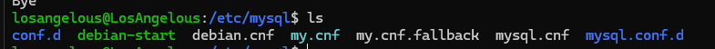
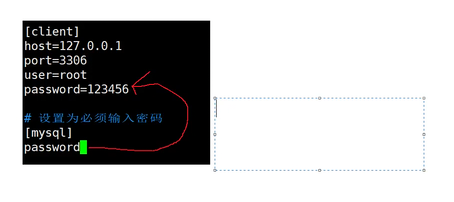

1. 

我们可以配置 mysql 客户端
这样就可以 直接运行mysql 不需要输入用户名和密码



修改这个my.cnf 然后加入

[client]
port=3306
host=127.0.0.1
user=root
password=!Lsj20041021

j就可以自动登录了

- [ ] 11_13
- [ ] 
- [ ] 

2. 

[客户端的程序名] > [client] 优先级



下面这个就会覆盖上面这个

- [ ] 11_13

3. 
- 可以通过 !include 来包含其他选项文件 
- 也可以通过 !includedir 指令来搜索指定目录中的其它选项文件
- 先扫描哪一个不一定 优先是 .cnf 后缀的文件 不保证顺序
- 养成习惯 所有的配置 都要最后换行一下

4. 设置编码集

```cnf
[client]
default-character-set=utf8mb4
```
*mb4 就是最小4个字节

- [x] 11_13
- [ ] 

5. 

每次修改配置文件之前 做好备份

- [x] 11_13
- [ ] 


