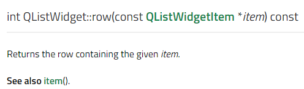

1. Qt's ActiveX
   如何理解？

答:

- 帮你在Qt里面调用别人的ActiveX/Com
- 或者把你的Qt 控件包装成 ActiveX/Com 给别人调用


2. 

 Qt 安全的强制类型转换
qobject_cast 强制类型转换

3. QListWidget 元素的删除



获取行的元素

然后 进行删除

```c++
 int row = ui->musicList->row(it);
 delete ui->musicList->takeItem(row);
```


元素的遍历可以参考

```c++
for(int i =0 ; i < ui->musicList->count(); i++)
    {
        QListWidgetItem* item = ui->musicList->item(i);
        if (item->data(role).toString() == uuid) {
            return item;
        }
    }
```


4. 删除数据库的指令

```sql
drop database test_db;
```


5. 

可以直接通过客户端的指令

mysql < test_db.sql -uroot -p


