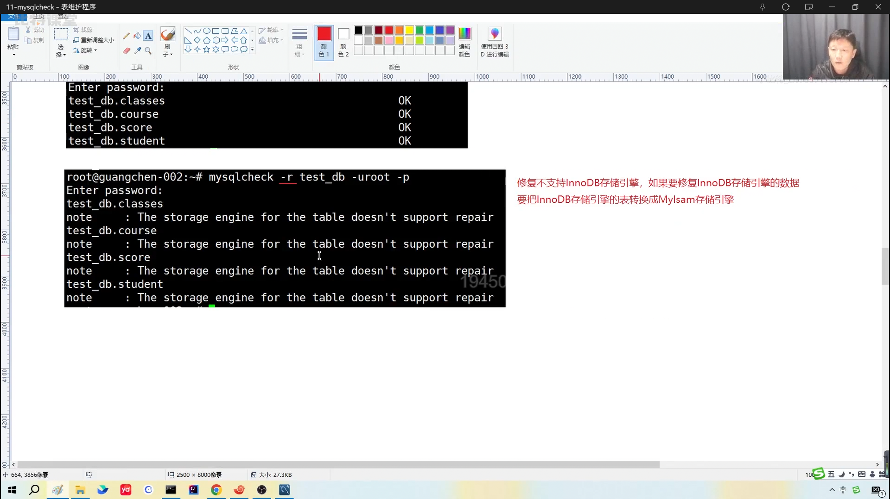

1. 
```shell
losangelous@LosAngelous:~/LosAngelous/Project/test$ mysqlcheck -r test_db -uroot -p
Enter password:
test_db.classes
note     : The storage engine for the table doesn't support repair
test_db.course
note     : The storage engine for the table doesn't support repair
test_db.score
note     : The storage engine for the table doesn't support repair
test_db.student
note     : The storage engine for the table doesn't support repair
```
表的修复


2. 
mysqldump 备份程序
```shell
losangelous@LosAngelous:~/LosAngelous/Project/test$ mysqldump test_db > /home/losangelous/LosAngelous/Project/test/dump.sql -uroot -p
Enter password:
```
相当于 给当前的数据库 拍照一样 以文本的形式保存下来


3. 
mysqladmin version 的作用是？
- 连接到 mysql的服务器
- 向服务器发送 STATUS 的请求
- 返回服务器的版本信息 + 当前运行状态

- [ ] 11_17
- [ ] 

4. mysqladmin status
    用来快速查看 MySQL 服务器当前状态
    服务器运行的秒数
    查询的数量等等

- [ ] 11_17


5. mysqladmin create `<database_name>`
    创建数据库 

drop 是对应的删除操作

  - [ ] 11_17

 mysqladmin extented-status -uroot -p
