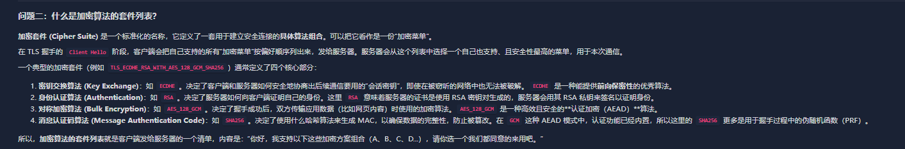
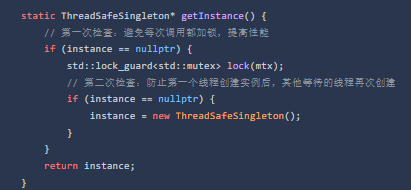

1. HTTPS 的握手过程

a. 客户端问候   客户端发起请求  并带上自己支持的 TLS 版本一个随机数以及支持的加密算法的套件列表

- [x] 11_20 r
- [ ] 11_20 

b. 服务端响应  服务器收到之后 选择一个双方都支持的加密套件，并生成一个自己的随机数

​	服务器 同时会把自己的数字证书 一起发送给客户端

- [ ] 

c. 客户端收到证书之后 会用操作系统或者浏览器内置的 CA 根 证书 来验证证书的合法性 

​	验证通过后 客户端生成第三个随机数  “预主密钥” 然后从服务器证书里拿到的公钥对这个预主密钥进行加密，再发送给服务器

- [ ] 

d. 生成会话密钥与完成握手

​	服务器 收到加密的预主密钥之后，就会用自己的私钥进行解密，得到预主密钥

​	现在双方都有了三个  （两个随机数 + 一个预主密钥） 它们会使用实现约定好的算法，各自独立地计算出完全相同的对称加密密钥，也就是”会话密钥“ 

- [ ] 11_20

e. **`Finished` 消息的验证过程** 最后双方都会 发送一个 finished的消息  用刚刚生成的会话密钥加密。再进行各自解密，就代表握手成功

而是一个基于到目前为止所有握手消息（包括 ClientHello, ServerHello, Certificate 等）计算出的验证码 (MAC)

- [ ] 11_20

2. 数字证书

- 包含了 服务器的公钥，域名信息，以及由CA机构的私钥签名


3. CA 机构？

- 证书颁发机构


4. 加密算法的套件列表 是什么？




5. 

单例模式

static LazySingleton* instance; （类内）




- [x] 11_20


static EagerSingleton* instance;（类内）

EagerSingleton* EagerSingleton::instance = new EagerSingleton();  (全局)


- [x] 11_20


第三种

```c++
static MeyersSingleton& getInstance() {
        // C++11 保证了局部静态变量的初始化是线程安全的
        static MeyersSingleton instance;
        return instance;
    }
```


