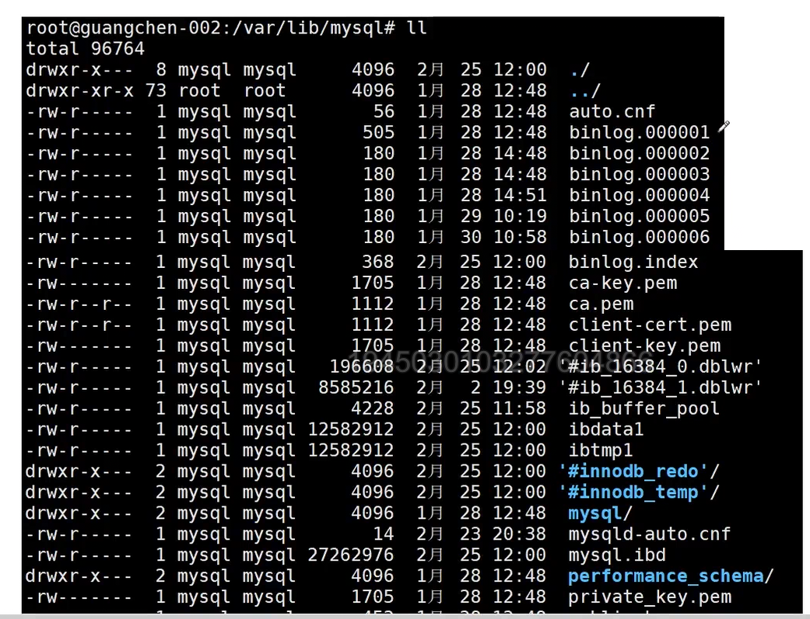
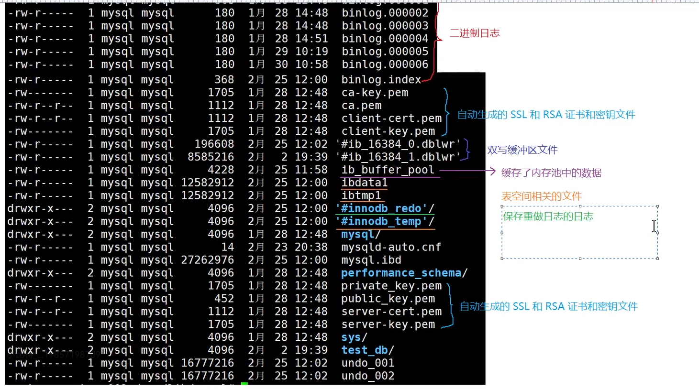

1. 多态是以封装和继承为基础的。在C++中多态分为静态多态（早绑定）和动态多态（晚绑定）两种，其中动态多态是通过虚函数实现，静态多态通过函数重载实现

2. 你能否讲述一次你诊断和修复多线程相关Bug（如死锁、竞态条件）的经历

答：

- 我做的模块在高并发的情况下会偶发性地崩溃           

3. 

binlog.000001 二进制文件

mysql/ 就是系统级别的库

- [ ] 11_22

mysql.ibd 系统级别的管理信息

- [x] 11_22

mysqld-auto.cnf 保存动态设置的系统变量

- [ ] 11_22

test_db/  是自己创建的库

- [ ] 11_22

undo_001 就是撤销日志

undo_002 也是

- [x] 11_21

4. 

mysql的日志有哪些？

错误日志

一般查询日志

慢查询日志

二进制日志

中继日志

DDL日志

回滚日志/撤销日志

重做日志

5. 

Linux下面默认开启错误日志和二进制日志

